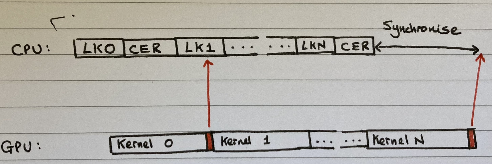

## Introduction

If we know anything of machine learning in 2023, it is this: bigger is better. Give your model more data, parameters, and compute and success is (somewhat) guaranteed.

However, larger models are both memory intensive and slow. To combat this, there exists a broad range of optimization techniques to minimise training and inference costs. Some focus on efficient implementation of the ubiquitous Transformer architecture (FlashAttention[5], ZeroQuant[6]). Others involve algorithmic changes (Pruning, Sparsity [add references here]). Underlying all of these is the need to accurately measure the cost of each operation in a computational graph.

In this blog, we present a comprehensive guide to the tips & tricks needed to reliably time operations in PyTorch, whilst avoiding common pitfalls. Getting this right and extracting the best possible performance is critical to Speechmatics' ability to offer game changing ASR accuracy in a real-time setting.

## Timing on CPU

### Host-Device Synchronization

As is well known, PyTorch executes GPU based kernels asynchronously. Whilst a CUDA kernel runs on GPU, the CPU continues to queue up further kernels behind it. This prevents being bottlenecked by general overhead costs such as launching kernels and those associated with the Python interpreter.

This has implications for timing GPU operations. If we take a naïve approach we end up simply timing the kernel launch, and not the time taken for a kernel to execute. The common solution is to call `torch.cuda.synchronize()` before taking a timing measurement. This waits for all kernels in all CUDA streams to complete. In other words, it stalls the host thread until the GPU finishes all assigned tasks. Here's an example:

```python
import torch
from time import perf_counter

times = []
sync_times = []

# This won't time the CUDA kernel -  only the launch overhead
for _ in range(10):
    start_time = perf_counter()
    
    run_kernel()
    
    end_time = perf_counter()
    times.append(end_time - start_time)
    
    
# This measures what we actually care about
for _ in range(10):
    start_time = perf_counter()
    
    run_kernel()
    torch.cuda.synchronize()
    
    end_time = perf_counter()
    sync_times.append(end_time - start_time)
```

## Timing on GPU
When timing on CPU, we are not just timing kernel execution. We also account for time associated with overhead costs, as described above.

But sometimes we care only about the kernel timings themselves. This section describes a series of tricks that can help in achieving accurate measurements.

### CUDA events

When combining explicit synchronization points with perf_counter, we are not just timing kernel execution. This also includes the overhead associated with the kernel launch, as described above. Creating additional synchronization points may also be undesirable when trying to time in a production-level setup.

CUDA Events are a neat way to prevent us from timing kernel launch overhead and creating unnecessary synchronization points. Consider the following code:

```python
start_event = torch.cuda.Event(enable_timing=True)
end_event = torch.cuda.Event(enable_timing=True)

times = []
for _ in range(10):
    start_event.record()
    
    run_kernel()
    
    end_event.record()
    torch.cuda.synchronize()
    times.append(start_event.elapsed_time(end_event))
```

We begin by instantiating two `torch.cuda.Event()` objects. The `record()` method essentially puts a time stamp in the stream of kernel execution. Doing so before and after the operations that we wish to time means we can measure exactly how long it takes for them to execute. At the end of the block we wish to time, we must include a `synchronize()` statement before running `start_time.elapsed_time(end_event)`. Omitting this means that the CPU would attempt to calculate the elapsed time before the GPU has finished its work, yielding a `RuntimeError`.

This image illustrates these ideas:



### Warmup steps

A further improvement we can make to our above examples is to include warmup steps prior to doing timed runs. This is needed to discard overheads only incurred at the start of a training or inference run, for example:

·      Optimization passes / codegen applied by PyTorch’s JIT fuser after the first few input tensors are encountered

·      On-the-fly microbenchmarking carried out by torch.cudnn.benchmark when selecting optimal convolution kernel for a given input shape

Here's a simple example:

```python
for _ in range(10):
    run_kernel() # don't record time

start_event = torch.cuda.Event(enable_timing=True)
end_event = torch.cuda.Event(enable_timing=True)
 
times = []
for _ in range(10):
    start_event.record()
    
    run_kernel()
    
    end_event.record()
    torch.cuda.synchronize()
    times.append(start_event.elapsed_time(end_event))
```

### Fixed clocks

So far, we have focused on making our profiling results accurate. But how can we make them consistent? The clock speed on GPUs can vary significantly according to limits on temperature and power consumption. As such, fixing the clock can substantially improve the reproducibility of our results. We have found this to be especially important for our work at Speechmatics.

One caveat is that selecting a clock speed with `nvidia-smi` doesn't guarantee that your GPU will run at the requested speed. The GPU always retains the ability to decrease the clock speed (throttling) - this is to prevent damage to the hardware. But by setting the clock speed to some rate sufficiently below the maximum, we can ensure that the level of throttling is less severe.

Here's an example of how to implement this in Python. We use a similar approach to that of OpenAI's Triton DSL [6] and Deepmind's AlphaTensor [7] repositories.

```python
import os
import subprocess

DEVICE = os.environ.get("CUDA_VISIBLE_DEVICES")
CLOCK_SPEED = 1350  # Must choose a clock speed that's supported on your device.

def set_clock_speed():
    """
    Set GPU clock speed to a specific value.
    This doesn't guarantee a fixed value due to throttling, but can help reduce variance.
    """
    process = subprocess.Popen("nvidia-smi", stdout=subprocess.PIPE, shell=True)
    stdout, _ = process.communicate()
    process = subprocess.run(f"sudo nvidia-smi -pm ENABLED -i {DEVICE}", shell=True)
    process = subprocess.run(f"sudo nvidia-smi -lgc {CLOCK_SPEED} -i {DEVICE}", shell=True)


def reset_clock_speed():
    """
    Reset GPU clock speed to default values.
    """
    subprocess.run(f"sudo nvidia-smi -pm ENABLED -i {DEVICE}", shell=True)
    subprocess.run(f"sudo nvidia-smi -rgc -i {DEVICE}", shell=True)
```

### Cache flush

### __nanosleep / CUDA graphs

We previously saw that CUDA events hide the overhead of launching a kernel (the fixed time between the host launching a kernel and it being executed on the GPU). However, this is not a silver bullet as it makes the assumption that there is no time gap between the kernel in question and the surrounding CUDA events in the command queue. That is, it assumes the preceding CUDA event completes immediately before the kernel is due to be executed, and the following CUDA event starts as soon as the kernel is complete. When we are timing lightwight kernels that are fast to execute this assumption can break down. This can lead to spurious results which contain launch overhead in the CUDA events delta, and is illustrated in the diagram below.

Luckily there are solutions, the simplest is to apply backpressure to the command queue to ensure that the the kernel and it's events are enqueued together, rather than being executed before the next command even has a chance to make it onto the queue. A naive appraoch to this would be to launch a sufficiently expensive kernel prior to the events/kernel we are interested in, to create a backlog. A cleaner solution would be to ask the GPU to wait for a fixed number of instruction cycles, either by using CUDA's __nanosleep or torch.cuda._sleep.

## References

Lilian Weng blog post ([https://lilianweng.github.io/posts/2023-01-10-inference-optimization/](https://lilianweng.github.io/posts/2023-01-10-inference-optimization/))  
Flash Attention  
ZeroQuant
Triton Language ([https://github.com/openai/triton/blob/ba0198326e280192bff9cd656a0a231b613901fa/python/triton/testing.py#L420](https://github.com/openai/triton/blob/ba0198326e280192bff9cd656a0a231b613901fa/python/triton/testing.py#L420))  
AlphaTensor ([https://github.com/deepmind/alphatensor/blob/1949163da3bef7e3eb268a3ac015fd1c2dbfc767/benchmarking/run_gpu_benchmark.py#L56](https://github.com/deepmind/alphatensor/blob/1949163da3bef7e3eb268a3ac015fd1c2dbfc767/benchmarking/run_gpu_benchmark.py#L56))
