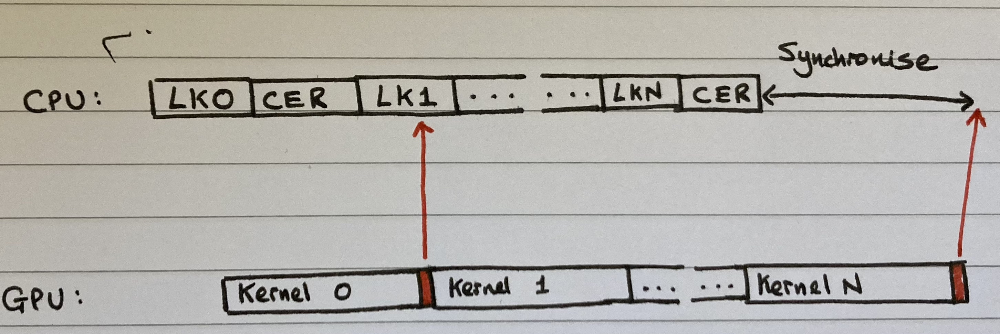

These notes concern the topic of timing operations in PyTorch. They were made to consolidate a day's work that I did in understanding [CUDA Events](https://pytorch.org/docs/stable/generated/torch.cuda.Event.html).

[This](https://leimao.github.io/blog/PyTorch-Benchmark/#CPU-Timer-CUDA-Timer-and-PyTorch-Benchmark-Utilities) Lei Mao blog is another very useful resource.
```toc
```

## Synchronisation

^ea7d29

As is well known, PyTorch executes asynchronously. In other words, while running a CUDA kernel on the device, it continues to queue up further CUDA kernels behind it. This prevents being bottlenecked by general overhead costs, such as launching CUDA kernels and those associated with the Python interpreter.

Asynchronous functions put an order on a "CUDA execution queue". When the GPU finishes its current assignment, it pops the next order and executes it. This is all done in a separate thread, handled by the CUDA driver. This is separate from the program host thread.

Clearly, this has implications for timing operations. We might end up simply timing the kernel launch, and not the time it takes for the kernel to execute! The common solution is to call `torch.cuda.synchronize()` before taking a timing measurement. This waits all kernels in all [streams](../GPUs/CUDA%20Streams.md) on a CUDA device to complete. In other words, it stalls the host thread until the GPU finishes *all* assigned tasks.

## Timing Operations on CPU
Timing operations on CPU is fairly straightforward. The only *gotcha* is that we must [synchronise](#^ea7d29) before taking final timing measurements.

Some example code is shown below:

```Python
from timeit import default_timer as timer
import torch

def measure_time_host(model, input_tensor, num_repeats=100, num_warmups=10):
	#Warmup steps
	for _ in range(num_warmups):  
	        _ = model.forward(input_tensor)  
	torch.cuda.synchronize()  
	
	start = timer()  
	for _ in range(num_repeats):  
		_ = model.forward(input_tensor)  
	# Wait for kernels to execute on GPU
	torch.cuda.synchronize()  
	end = timer()  
	elapsed_time_ms = (end - start) * 1000

	return elapsed_time_ms / num_repeats
```

## Timing Operations on GPU
When timing on the CPU, we are are not just timing how long it takes for the CUDA kernels associated with our code to execute. We will also be accounting for time associated with overhead costs, such as launching CUDA kernels (this is done asynchronously on the CPU).

But what if we only want to time kernel execution on the GPU? This can be done using `torch.cuda.Event()` objects.

Some example code is shown below:

```Python
import torch

def measure_time_device(model, input_tensor, num_repeats=100, num_warmups=10):
	#Warmup steps
	for _ in range(num_warmups):  
	        _ = model.forward(input_tensor)  
	# No need to synchronise after warmup steps
	
	start_event = torch.cuda.Event(enable_timing=True)
	end_event = torch.cuda.Event(enable_timing=True)  
	start_event.record()
	for _ in range(num_repeats):  
		_ = model.forward(input_tensor)  
	end_event.record()
	
	# Wait for kernels to execute on GPU
	torch.cuda.synchronize()  
	elapsed_time_ms = start_event.elapsed_time(end_event)

	return elapsed_time_ms / num_repeats
```

We begin by instantiating two `torch.cuda.Event()` objects. The `.record()` method essentially puts an item in the CUDA stream that says something like: "When all previous work has been done, flag me this variable".

It's like putting a time stamp in the stream of kernel execution.

Doing this before and after the operations that we wish to time means that we can measure how long it takes for kernels to execute. The image below illustrates this:



>[!INFO]
> How does this diagram relate to operator fusion? E.g. Kernel 1 & 2 aren't fused, vs are fused? I guess I don't really understand how transferring information between host and device relates to this picture. 

LK stands for "launch kernel", and CER stands for "CUDA Event record". The beginning of kernel 0 should align with the end of LK0.

The key point is the CUDA events put an "event" in the CUDA stream that return a timestamp when executed. At the end of the block we wish to time, we must include a `torch.cuda.synchronize()` statement before running `start_event.elapsed_time(end_event)`. If we do not do this, the CPU will try to calculate the elapsed time before the GPU has finished its work. In practice, if we try to calculate timings without the synchronise statement we get a `RuntimeError`.

> [!INFO]
> Using CUDA Events does **not** guarantee that we don't time kernel launch overhead. It depends on when the last `torch.cuda.synchronize()` was called. If it is called immediately before `start_event.record()`, then we will end up timing the first few kernel launches.

### Two Approaches to Synchronisation
It is worth noting that, when using CUDA Events, there are two approaches to synchronising between CPU and GPU. The first is to use `torch.cuda.synchronize()`, as above. This stalls the host thread until the GPU finishes *all* assigned tasks.

Alternatively, CUDA Event objects have a `synchronize()` method that we can use, e.g. `end_event.synchronize()`. This stalls the host thread until the GPU reaches the CUDA Event record that we placed with `end_event`. This can be seen as a weaker version of `torch.cuda.synchronize()`. The advantage of this is that after synchronisation, upcoming CUDA kernels have already been launched, meaning that there is no idle GPU time while waiting for kernel launches to complete.

### CPU vs GPU Timings
The question remains: is one of these approaches to timing better than the other? The answer depends on the context. My current thinking is the GPU timing is sometimes preferable to CPU timing, but CPU timing is never preferable.

To see why GPU timings can be preferable to CPU timings, consider this code from `aladdin/am/train/train.py`:

```Python
# Body Forward Pass
start_time = perf_counter()
inputs = inputs.to(device=device, dtype=torch.float16)
inputs = body.forward_batch(inputs, chunk_size=body_chunk_size, augment=True)
torch.cuda.synchronize()
body_time += perf_counter() - start_time

# Head Forward Pass
start_time = perf_counter()
outputs, _, _, _ = head(inputs.float())
torch.cuda.synchronize()
head_forward_time += perf_counter() - start_time

# Loss Calculation
start_time = perf_counter()
total_batch_loss = criterion(outputs, supervision)
losses.append(total_batch_loss.item())
torch.cuda.synchronize()
loss_time += perf_counter() - start_time

# Head Backward Pass
start_time = perf_counter()
loss = total_batch_loss / (grad_acc_steps * output_frames)
loss.backward()
torch.cuda.synchronize()
head_backward_time += perf_counter() - start_time
```

We need a total of 4 `torch.cuda.synchronize()` statements - one for every component we wish to time. If we used GPU-based timings, we would only need one such statement.

## Saturating GPU Stream when Timing Small Kernels
Cache Flusing: https://github.com/openai/triton/issues/404

Cuda sleep 

CUDA Graphs

This presentation is really good: https://on-demand.gputechconf.com/gtc/2014/presentations/S4158-cuda-streams-best-practices-common-pitfalls.pdf

Between CPU timings, GPU timings, kernel dumps, and profiler tensorboard, we can catch/explain most bad stuff.

Use different inputs each time to avoid potentially exploiting caches.

> [!DANGER]